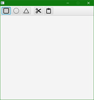
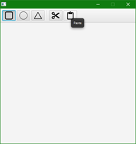
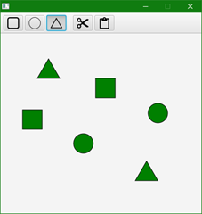
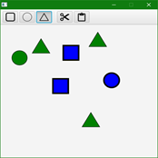
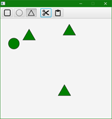
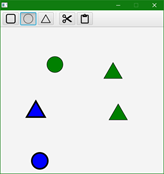
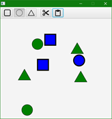
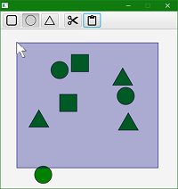

# CS3035 Assignment 4 

## Selecting Objects and Organizing MVC Apps

### Due: Friday, November 19th, 11:55pm

## Overview

In this assignment, you will gain experience with the
Model-View-Controller pattern and build an understanding of the inner
workings of common user interactions. You will extend the provided 
SquareDrawerWithDragSelections example discussed in class to create
some basic and robust user interactions.

This assignment will consist of 4 distinct smaller parts that can be
worked on individually. The other parts do not necessarily rely on one
another, although completing Part 1 first, followed by part 2 will make it much easier for you to work on parts 3 and 4. You will submit only assignment for this assignment, and you will be graded on the parts of the assignment that you complete.

## Before You Get Started

- Please remember to update the AUTHOR.md file with your details.
- Read this whole assignment, so you know what is coming.
- Fill in the provided class code with code that you draw from the SquareDrawerWithDragSelections. 

## Part 1: Add a Toolbar

First, start by adding a simple toolbar. The toolbar should provide two sets of buttons that contain only icons (the images are provided in the images directory). Your ToolBar should provide two sets of buttons. The first set are ToggleButtons (representing shapes) that can be drawn in the application. ToggleButtons only allow one option to be selected at a time (when associated with a common ToggleGroup). The leftmost ToggleButton should be depressed by default.


| | |
|:---:|:---:|
| Toolbar | Toolbar with added Tooltip |

The two sets of buttons are separated by a Separator object (see Toolbar Tutorial). The second set of buttons are for ‘Cut’ and ‘Paste’ operation. These are Button objects, so they do not have a “toggled” state.

Add ToolTips to each of your buttons, so that after a brief hovering
over a button with the mouse, a label for the button appears. See second image, showing “Paste”.

For this part, no actions need to be taken when clicking the buttons.
The actions associated with the buttons will be in Parts 2 and 3. You
should use JavaFX code to create the ToolBar and buttons and not FXML.

Think carefully about where your code should be placed for creating the ToolBar.

### Hint for Part 1
```Java
//creating a toolbar toggle button in your project
Image squareImg = new Image(getClass().getClassLoader().getResourceAsStream("images/square.png"));
ToggleButton squareButton = new ToggleButton("", new ImageView(squareImg));
```

### Resources for Part 1

-   ToolBar Tutorial: <http://tutorials.jenkov.com/javafx/toolbar.html>
-   ToggleButton Tutorial:
    <https://docs.oracle.com/javafx/2/ui_controls/toggle-button.htm>
-   Button Tutorial: <http://tutorials.jenkov.com/javafx/button.html>
-   Tooltip Tutorial:
    <https://docs.oracle.com/javafx/2/ui_controls/tooltip.htm#BABBIJBJ>

## Part 2: Draw Different Shapes 

You should finish Part 1 before completing Part 2, to make it easy to
select a shape to be drawn. You will extend the application and make it work with shapes of different types. A user will be able to select the button at the top of the app (Square, Circle or Button) and create the correct item. Creating items will work by simply depressing the desired shape button and clicking on an empty part of the canvas (which is the same way squares are created in the provided example). 

Shapes should respond precisely to clicks, e.g., a click must fall directly within the shape to count as a click on the shape. Shapes can be clicked and dragged, selected and moved as in the provide example (SquareDrawerWithDragSelections).



Likely the easiest approach to making this happen is to generalize the
provided example code (in the SqaureDrawerWithDragSelections example), so that it works with the super class (i.e., Shape instead of Square). You can then provide methods similar to the addSquare method in the Model class, for adding shapes of other kinds. In all cases the center of the shape should appear at the point of the cursor. An equilateral triangle can be drawn using the [Polygon](https://docs.oracle.com/javase/8/javafx/api/javafx/scene/shape/Polygon.html) class.

Additionally, all shapes should be the same size; i.e., square side length = circle diameter = triangle height.

### Hint

In the provided example, the controller checks to see if an event
target is an instance of the Rectangle class. But, you may want to check to see if an event comes from any type of shape. You can use the following line to test whether a target object class inherits from Shape: ```Shape.class.isAssignableFrom(e.getTarget().getClass())```

### Resources for Part 2

-   Calculator for determining the side length of an equilateral
    triangle for a given height (select “equilateral” for the “Special
    Triangle?” drop-down):
    <https://www.omnicalculator.com/math/triangle-height>
-   Shape API:
    <https://docs.oracle.com/javase/8/javafx/api/javafx/scene/shape/Shape.html>
-   Polygon API:
    <https://docs.oracle.com/javase/8/javafx/api/javafx/scene/shape/Polygon.html>
-   Circle API:
    <https://docs.oracle.com/javase/8/javafx/api/javafx/scene/shape/Circle.html>

## Part 3: Simple Cutting and Pasting

In Part 3, you will implement simple cutting and pasting, by attaching
actions to the “Cut” and ”Paste” buttons created in Part 1.

Drawn objects should be able to be selected in the same way as was
provided in the starting example code. When the cut button is clicked,
selected items are cut from the scene. Any operations can then continue with the interface. If the Paste button is clicked, the “cut” items are returned to their original place, and are the active selection. If additional objects are cut while there are already other objects cut, then the previously cut objects are discarded (similar to how normal cut-and-paste works). The Paste button only works once. That is if items are pasted once, clicking Paste again, won’t paste additional copies of the objects to the scene.

### Hint

For this simplified pasting. You will not need to make “copies” of
objects, you will just need to keep references to objects in several places.

|  |  |  |  |
|:---:|:---:|:---:|:---:|
| Three objects are selected in the interface. | The “cut” button is pressed, removing the three objects, and storing them on the “clipboard”. | Other work is done with the objects in the interface. | Later the “paste” button is pressed, returning the cut objects to their original position. |
 
## Part 4: Rubber-band Drag Selections from Multiple Directions

In Part 4, you will extend the rubber band rectangle selection technique so that drag selections can be done in any direction. In the current example, the Rectangle selection region is drawn from top-left to bottom right only. You will add code so that the region can resize when the mouse is dragged in any direction.



Evaluation 
-----------

Marks will be given for producing a system that meets the requirements above, and compiles and runs without errors. Note that no late assignments will be allowed, and no extensions will be given without medical reasons or pre-agreed arrangements.
